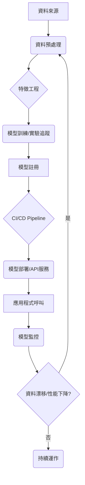

哈囉，親愛的程式夥伴們！歡迎來到我們「每日精進」旅程的【第 47 天】！

今天，我們將跳脫純粹的程式碼練習，一起翱翔於 MLOps (Machine Learning Operations) 的廣闊天空。你可能會想：「什麼是 MLOps？聽起來好複雜！」別擔心，把它想像成是把你的厲害機器學習模型，從實驗室裡的「寶貝專案」，變成能在真實世界中穩定運作、甚至自動更新的「超級英雄」。

### 主題：【第 47 天：實戰：MLOps 專案案例研究與架構設計】

在過去的學習中，我們花了很多時間在資料處理、模型訓練與評估上。這些都是機器學習的核心。但當你的模型真的要投入使用時，你會發現還有很多挑戰：資料怎麼管理？模型版本怎麼追蹤？模型訓練完怎麼部署？上線後怎麼監控它的表現？當它表現不好時怎麼自動更新？這就是 MLOps 要解決的問題！

### 什麼是 MLOps？簡單來說就是「ML + DevOps」

MLOps 旨在將 DevOps（開發運營）的原則應用於機器學習工作流程。它是一個結合了文化、實踐和工具的方法，讓機器學習模型能穩定、自動化、高效地從開發階段走到生產環境，並持續維護的理念與實踐。

### 案例研究：電影評論情感分析系統

讓我們來設計一個 MLOps 架構，目標是建立一個能夠即時判斷電影評論是正面還是負面的系統。

**專案目標：**

1.  **訓練：** 使用歷史電影評論資料訓練一個情感分析模型。
2.  **部署：** 將訓練好的模型部署為一個 API 服務，讓其他應用程式可以呼叫。
3.  **監控：** 監控模型的預測效能，並在必要時觸發自動再訓練。

### MLOps 專案架構設計 (概念圖)

想像一下這個流程，它像是一條生產線：



### 各環節與對應工具

1.  **程式碼與資料管理 (Code & Data Management):**
    *   **程式碼：** `Git` (GitHub, GitLab, Bitbucket) 用來版本控制所有模型程式碼、訓練腳本、部署配置。
    *   **資料：** `DVC (Data Version Control)` 用來版本控制你的訓練資料集和模型，確保資料的可追溯性與重現性。

2.  **實驗追蹤與模型訓練 (Experiment Tracking & Model Training):**
    *   **訓練框架：** `Scikit-learn`, `TensorFlow`, `PyTorch` 等。
    *   **實驗追蹤：** `MLflow` 是一個超級實用的工具！它可以記錄你的訓練參數、模型指標、甚至模型的二進位檔本身。這樣你就能回溯每次實驗的細節。
    *   **計算資源：** 通常會在雲端 VM 或 Kubernetes 上運行訓練。

3.  **CI/CD 與自動化部署 (CI/CD & Automated Deployment):**
    *   **CI/CD 工具：** `GitHub Actions`, `GitLab CI`, `Jenkins`。當你推動程式碼到 Git 倉庫時，它們會自動觸發測試、打包、部署等流程。
    *   **容器化：** `Docker`。將你的模型和其運行環境打包成一個獨立、輕量的容器。這確保模型在任何環境下都能一致地運行。
    *   **部署平台：** `Kubernetes` (用於大規模部署和管理容器), `AWS SageMaker`, `Azure ML`, `GCP AI Platform` (雲端原生的 ML 服務), 或者簡單的 `Flask`/`FastAPI` 搭配 `Docker` 建立一個 API。

4.  **模型監控與再訓練 (Model Monitoring & Retraining):**
    *   **監控工具：** `Prometheus` (指標收集), `Grafana` (視覺化儀表板)。監控模型的預測量、延遲、錯誤率，以及最重要的：**模型效能** (例如精確度、F1 分數) 和**資料漂移 (Data Drift)**。
    *   **自動化再訓練：** 當監控系統偵測到模型效能下降或資料分佈改變時，可以自動觸發整個訓練流程，生成新的模型並部署。

### 具體程式碼範例：使用 MLflow 追蹤實驗

我們來看看如何用 `MLflow` 記錄一個簡單的模型訓練過程。

首先，確保你安裝了 `mlflow` 和 `scikit-learn`:
`pip install mlflow scikit-learn`

```python
import mlflow
import mlflow.sklearn
from sklearn.model_selection import train_test_split
from sklearn.linear_model import LogisticRegression
from sklearn.metrics import accuracy_score, precision_score, recall_score
import pandas as pd
import numpy as np

print("--- MLOps 情感分析模型訓練範例 ---")

# 1. 準備模擬資料
# 假設我們有一些電影評論的文本特徵 (這裡簡化為隨機數) 和對應的情感標籤
np.random.seed(42)
num_samples = 100
X = np.random.rand(num_samples, 10) # 10個特徵
y = np.random.randint(0, 2, num_samples) # 0: 負面, 1: 正面

# 分割訓練集和測試集
X_train, X_test, y_train, y_test = train_test_split(X, y, test_size=0.2, random_state=42)

# 2. 啟動一個 MLflow 實驗 (會自動在本地建立一個 'mlruns' 資料夾)
# 你可以在終端機執行 `mlflow ui` 來查看結果
with mlflow.start_run():
    # 定義模型參數
    solver_param = "liblinear"
    max_iter_param = 100

    # 3. 記錄參數
    mlflow.log_param("solver", solver_param)
    mlflow.log_param("max_iter", max_iter_param)
    print(f"記錄參數: solver={solver_param}, max_iter={max_iter_param}")

    # 4. 訓練模型
    model = LogisticRegression(solver=solver_param, max_iter=max_iter_param)
    model.fit(X_train, y_train)

    # 5. 進行預測並計算指標
    y_pred = model.predict(X_test)
    accuracy = accuracy_score(y_test, y_pred)
    precision = precision_score(y_test, y_pred)
    recall = recall_score(y_test, y_pred)

    # 6. 記錄指標
    mlflow.log_metric("accuracy", accuracy)
    mlflow.log_metric("precision", precision)
    mlflow.log_metric("recall", recall)
    print(f"記錄指標: Accuracy={accuracy:.4f}, Precision={precision:.4f}, Recall={recall:.4f}")

    # 7. 記錄模型本身
    # 這樣你就可以在 MLflow UI 中下載或部署這個模型
    mlflow.sklearn.log_model(model, "sentiment_model", registered_model_name="MovieSentimentModel")
    print("模型已記錄為 'sentiment_model' (檔案) 及 'MovieSentimentModel' (註冊模型)")

print("\n實驗完成！請在終端機執行 'mlflow ui' 查看詳細結果。")
print("這段程式碼展示了 MLOps 中『實驗追蹤』的核心功能。")

```

執行上面的程式碼後，你可以在終端機輸入 `mlflow ui`，然後打開瀏覽器前往 `http://localhost:5000`，你就能看到這次實驗的詳細記錄了！參數、指標和訓練好的模型都井然有序地保存在那裡，是不是很酷？這就是 MLOps 讓你的實驗不再是黑盒子，而是有跡可循的利器！

### 總結與展望

今天的案例研究和架構設計，是不是讓你對 MLOps 有了更清晰的理解？MLOps 的世界博大精深，從資料管理、實驗追蹤、CI/CD 自動化、容器化、部署到監控，每一個環節都有其重要性。

作為初學者，你不需要一下子掌握所有工具。今天我們介紹的 `MLflow` 是一個很好的起點，它能讓你親身體驗 MLOps 中的「實驗追蹤」這個關鍵環節。

恭喜你！在學習的第 47 天，你已經開始接觸到如何將機器學習模型從概念變成產品的「魔法」了。這是一個充滿挑戰但也非常有成就感的領域。繼續保持好奇心，我們未來會更深入地探索這些迷人的技術！

期待我們在【第 48 天】再見！繼續學習，繼續成長！